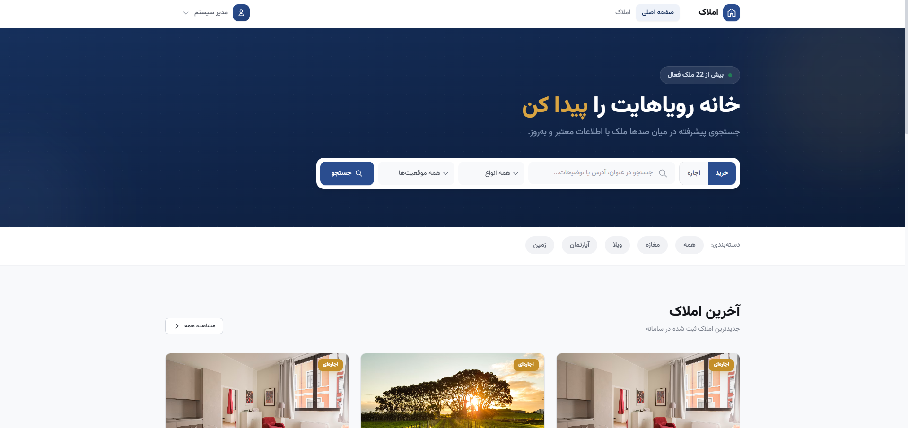
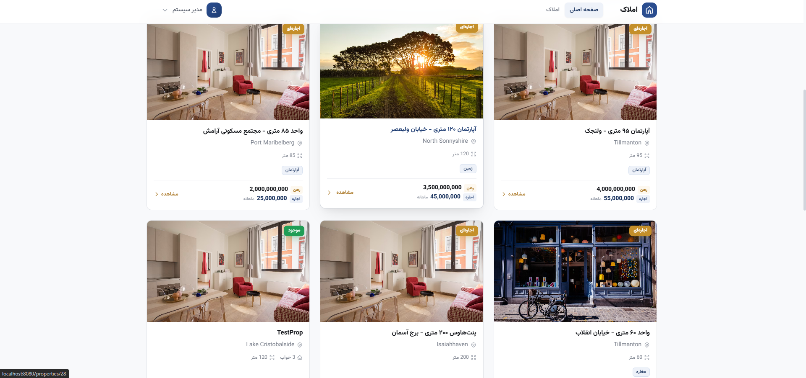
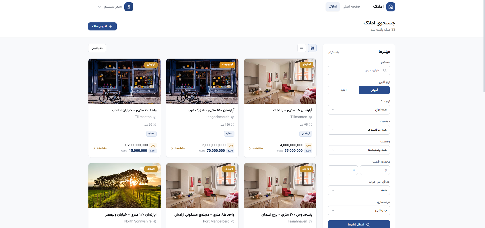
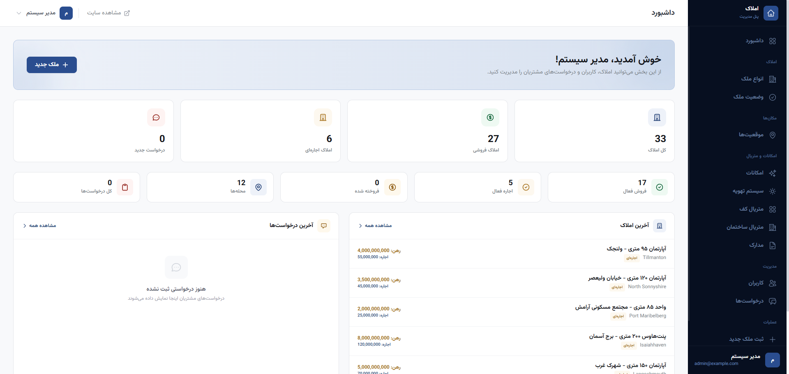

# Real Estate App (املاک)

A modern real estate listing platform built with Laravel, designed for the Iranian property market. Features a full admin panel, property management with rental support (رهن/اجاره), customer inquiry system, and a polished RTL (Persian) UI.

## Screenshots

### Homepage


### Property Listings


### Property Detail


### Admin Dashboard


### Property Management


## Features

### Public
- **Property Listings** — Browse properties with search, filters (type, location, price, bedrooms), grid/list view toggle
- **Rental Support** — Separate listing types for sale (فروش) and rental (اجاره) with deposit (رهن) and monthly rent (اجاره) display
- **Property Detail Pages** — Image gallery with carousel, key specs, full details, amenities, similar properties
- **Inquiry System** — Visit request form with date/time picker, spam protection (honeypot + throttle)
- **Responsive Design** — Mobile-first, works on all screen sizes

### Admin Panel
- **Dashboard** — Stats overview, recent properties, recent inquiries, quick actions
- **Property Management** — Full CRUD with image support, status tracking, owner assignment, listing type toggle
- **Location Management** — Hierarchical locations (parent/child), CRUD operations
- **User Management** — Create/edit users, admin flag toggle, force password change
- **Inquiry Management** — View/filter/update status (pending → contacted → closed), delete
- **Lookup Tables** — Manage property types, statuses, features, climate systems, floor materials, building materials, documents
- **Role-Based Access** — Admin-only routes with middleware protection

### Authentication
- Login, Register, Logout
- Password Reset (forgot/reset flow)
- Email Verification
- Force Password Change (admin can require)
- Profile Management (update info, password, delete account)

## Tech Stack

- **Backend:** Laravel 11 (PHP 8.3+)
- **Frontend:** Blade, Tailwind CSS, Alpine.js
- **Database:** MySQL 8.0
- **Web Server:** Nginx
- **Containerization:** Docker Compose
- **Testing:** PHPUnit (455+ tests)
- **Font:** Vazirmatn (Persian)
- **Design:** RTL layout, Sneat-inspired admin dashboard

## Prerequisites

- [Docker](https://docs.docker.com/get-docker/)
- [Docker Compose](https://docs.docker.com/compose/install/)

## Getting Started

```bash
# 1. Clone the repository
git clone <repo-url> real-estate-app
cd real-estate-app

# 2. Copy environment file
cp .env.example .env

# 3. Build and start containers
docker compose up -d --build

# 4. Install PHP dependencies
docker compose exec php composer install

# 5. Generate application key
docker compose exec php php artisan key:generate

# 6. Run database migrations
docker compose exec php php artisan migrate

# 7. Seed database (creates admin user + sample data)
docker compose exec php php artisan db:seed
```

The application will be available at [http://localhost:8080](http://localhost:8080).

### Default Admin Credentials

After seeding, you can log in with:
- **Email:** admin@example.com
- **Password:** password

## Development

```bash
# View logs
docker compose logs -f

# Run artisan commands
docker compose exec php php artisan <command>

# Run tests
docker compose exec php php artisan test

# Run specific test file
docker compose exec php php artisan test tests/Feature/RentalPropertyTest.php

# Run composer commands
docker compose exec php composer <command>

# Build frontend assets (if modifying CSS/JS)
docker compose exec php npm run build
```

## Stopping

```bash
docker compose down
```

To also remove the database volume:

```bash
docker compose down -v
```

## Project Structure

```
├── docker/
│   ├── nginx/              # Nginx configuration
│   └── php/                # PHP-FPM Dockerfile
├── app/
│   ├── Http/Controllers/
│   │   ├── Admin/          # Admin CRUD controllers
│   │   │   ├── InquiryController.php
│   │   │   ├── LocationController.php
│   │   │   ├── LookupController.php
│   │   │   └── UserController.php
│   │   ├── PropertyController.php
│   │   └── PropertyInquiryController.php
│   └── Models/             # Eloquent models
├── database/
│   ├── factories/          # Model factories
│   ├── migrations/         # Database migrations
│   └── seeders/            # Database seeders
├── docs/screenshots/       # README screenshots
├── public/images/          # Static images
│   └── properties/         # Property type placeholders
├── resources/
│   ├── css/app.css         # Tailwind + custom components
│   └── views/
│       ├── admin/          # Admin panel views
│       │   ├── layouts/    # Admin layout
│       │   ├── partials/   # Sidebar
│       │   ├── inquiries/  # Inquiry management
│       │   ├── locations/  # Location management
│       │   ├── lookup/     # Generic CRUD views
│       │   └── users/      # User management
│       ├── components/     # Reusable Blade components
│       ├── layouts/        # Public layouts
│       └── properties/     # Property views
├── routes/web.php
├── tests/Feature/          # Feature tests
└── docker-compose.yml
```

## Testing

The project includes 455+ feature tests covering:

- Admin authorization & middleware
- Dashboard access & data display
- Property CRUD operations
- Rental property support (listing types, deposit/rent filtering, visibility)
- Location management
- User management
- Inquiry management
- Lookup table CRUD
- Authentication flows
- Profile management

```bash
# Run all tests
docker compose exec php php artisan test

# Run specific test file
docker compose exec php php artisan test tests/Feature/AdminDashboardTest.php

# Run rental-specific tests
docker compose exec php php artisan test tests/Feature/RentalPropertyTest.php
```

## License

[MIT](https://opensource.org/licenses/MIT)
